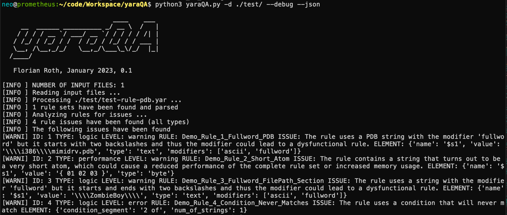

# yaraQA
YARA rule Analyzer to improve rule quality and performance

## Why?

YARA rules can be syntactically correct but still dysfunctional. yaraQA tries to find and report these issues to the author or maintainer of a YARA rule set.

The issues yaraQA tries to detect are e.g.:

- rules that are syntactically correct but never match due to errors in the condition (e.g. rule with one string and `2 of them` in the condition)
- rules that use string and modifier combinations that are probably wrong (e.g. `$ = "\\Debug\\" fullword`)
- performance issues caused by short atoms, repeating characters or loops (e.g. `$ = "AA"`; can be excluded from the analysis using `--ignore-performance`)

I'm going to extend the test set over time. Each minor version will include new features or new tests.

## Usage

```bash
usage: yaraQA.py [-h] [-f yara files [yara files ...]] [-d yara files [yara files ...]] [-o outfile] [--json]
                 [--ignore-performance] [--debug]

YARA RULE ANALYZER

optional arguments:
  -h, --help            show this help message and exit
  -f yara files [yara files ...]
                        Path to input files (one or more YARA rules, separated by space)
  -d yara files [yara files ...]
                        Path to input directory (YARA rules folders, separated by space)
  -o outfile            Output file that lists the issues
  --json                Save the issues as JSON
  --ignore-performance  Suppress performance-related rule issues
  --debug               Debug output
```

## Try it out

```bash 
python3 yaraQA.py -d ./test/
```

## Examples

Example rules with issues can be found in the `./test` folder. 

## Output

yaraQA writes the detected issues to a file named `yaraQA-issues.txt` by default.
If you select `--json` it'll be written to `yaraQA-issues.json`.

This listing shows an example of the output generated by yaraQA in JSON format:

```json
[
    {
        "rule": "Demo_Rule_1_Fullword_PDB",
        "issue": "The rule uses a PDB string with the modifier 'fullword' but it starts with two backslashes and thus the modifier could lead to a dysfunctional rule.",
        "element": {
            "name": "$s1",
            "value": "\\\\i386\\\\mimidrv.pdb",
            "type": "text",
            "modifiers": [
                "ascii",
                "fullword"
            ]
        },
        "level": "warning",
        "type": "logic"
    },
    {
        "rule": "Demo_Rule_2_Short_Atom",
        "issue": "The rule contains a string that turns out to be a very short atom, which could cause a reduced performance of the complete rule set or increased memory usage.",
        "element": {
            "name": "$s1",
            "value": "{ 01 02 03 }",
            "type": "byte"
        },
        "level": "warning",
        "type": "performance"
    },
    {
        "rule": "Demo_Rule_3_Fullword_FilePath_Section",
        "issue": "The rule uses a string with the modifier 'fullword' but it starts and ends with two backslashes and thus the modifier could lead to a dysfunctional rule.",
        "element": {
            "name": "$s1",
            "value": "\\\\ZombieBoy\\\\",
            "type": "text",
            "modifiers": [
                "ascii",
                "fullword"
            ]
        },
        "level": "warning",
        "type": "logic"
    },
    {
        "rule": "Demo_Rule_4_Condition_Never_Matches",
        "issue": "The rule uses a condition that will never match",
        "element": {
            "condition_segment": "2 of",
            "num_of_strings": 1
        },
        "level": "error",
        "type": "logic"
    }
]
```

## Screenshots


